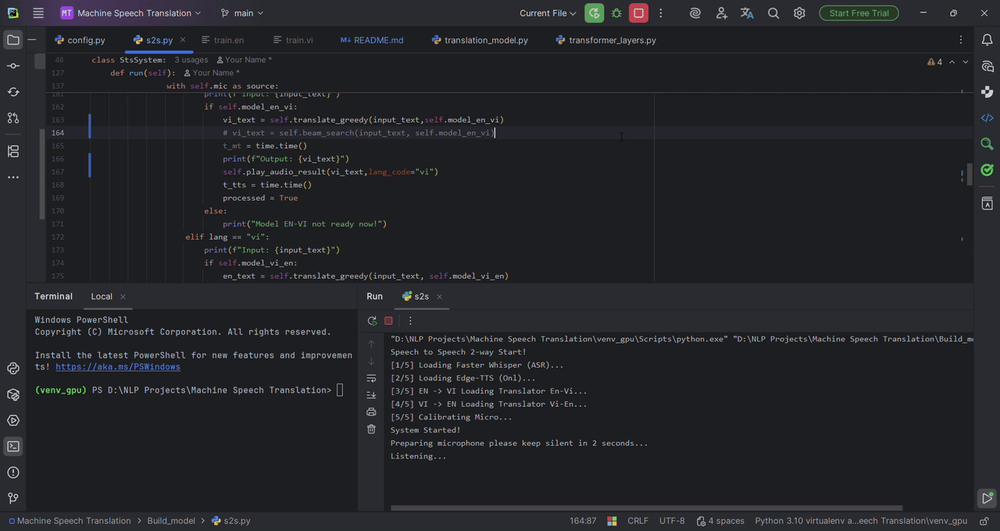
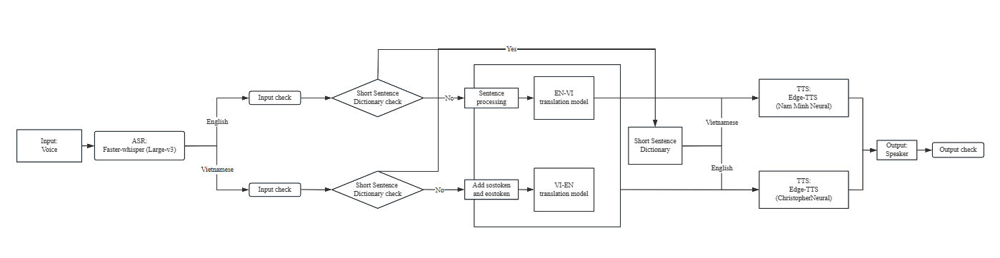
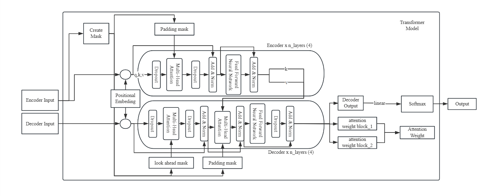

**Machine-Speech-Translation End-to-End (EN -> VI | VI -> EN)**
___
A Speech to Speech and Text to Text Machine Translation system using **FasterWhisper** for ASR, custom **Transformer** model for translation, and **edge-tts** to generate output speech.

___
--- Feature ---
- **Automatic Speech Recognition**: FasterWhisper (Large-v3 int8)
- **Translation**: Custom trained Transformer model (English <-> Vietnamese)
- **Text to Speech**: Edge-TTS for natural output sound
- **Human-in-the-loop**: Enable to check, fix and confirm input and translation's output 
- **Latency**: Optimize for acceptable latency (2-4s for 1 sentence)
___
---Demo Video---
- In this video my Custom Transformer Model will translate a short basic conversation between a foreigner and a local:
  - [](https://youtu.be/B_nKS6wxI8k)
___
---Architecture---
- System architechture:
  - 
- Custom transformer model architecture:
  - 
___
--- Installation --- 
1. Clone the repository:
    ```bash
    git clone [https://github.com/Secret350/Machine-Speech-Translation.git](https://github.com/Secret350/Machine-Speech-Translation.git)
    cd Machine Speech Translation
    ```
2. Install dependencies:
    ```bash
   pip install -r requirements.txt
   ```
3. Install NVIDIA Libraries (for GPU support):
    ```bash
   pip install nvidia-cublas-cu12 nvidia-cudnn-cu12
   ``` 
___
--- How to run program ---
* Use pre-trained model:

  - **First**: Install weight of pre-trained model "ModelCheckpoints" by the link below then extract and place that directory in Build_model 
  ```
  https://drive.google.com/file/d/1D0G29vXtSGe2wyjwIKx8lJDUWhNtzsKT/view?usp=drive_link
  ```
  - To run Text-to-Text (EN > VI) program
  ```bash
  cd Build_model/System_and_Evaluate
  python inference.py
  ```
  - To run Text-to-Text (VI > EN) program
  ```bash
  cd Build_model/System_and_Evaluate
  python inferencevien.py
  ```
  - To run Speech-to-Speech (EN <> VI) program
  ```bash
  cd Build_model
  python s2s.py
  ```
___
---Limitnations and Future Improvements---
- Limitnations:
  - Model struggles with difficult/uncommon word, proper noun or too short sentences.
  - The dataset lacks of many realife words.
- Future Improvements: 
  - Intergrating Named Entity Recognition module to solve the proper noun issue
  - Retrain model with larger and more focused dataset would improve model's performance
___
**NOTE**
You need to download "ffmpeg.exe" and place it in the "Build_model" folder.